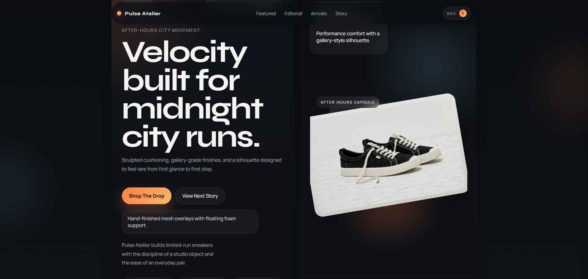

# Pulse Atelier — Premium Sneaker Showcase

A premium sneaker landing page built with **HTML, CSS, and JavaScript**, focused on strong product presentation, smooth motion, editorial layouts, and a polished mobile experience.



## Overview

Pulse Atelier is a high-end sneaker/product showcase designed to feel like a real campaign site rather than a generic template. It includes:

- dynamic hero section
- product color switching
- size selector
- mini cart
- arrivals slider
- editorial sections
- responsive mobile design
- refined dark/light section flow

## Tech Stack

- HTML5
- CSS3
- Vanilla JavaScript
- Swiper.js

## Features

- Premium hero section with product storytelling
- Interactive sneaker switching
- Product selection UI
- Animated arrivals carousel
- Mini cart interaction
- Editorial brand sections
- Mobile-first responsive layout
- Polished CTA and branded footer

## Project Structure

```bash
sneaker/
├── assets/
│   ├── sneaker-base.png
│   ├── shoe-aurora.svg
│   ├── shoe-ember.svg
│   ├── shoe-noctis.svg
│   └── vendor/
│       ├── swiper-bundle.min.css
│       └── swiper-bundle.min.js
├── index.html
├── styles.css
├── script.js
└── README.md
```
